# Water Usage Monitor — Backend Architecture & Design Patterns

A Spring Boot application for tracking household water consumption, detecting anomalies, managing conservation goals, and generating reports. Built for CSEN 359 (Design Patterns) at Santa Clara University.

---

## Table of Contents

1. [High-Level Architecture](#high-level-architecture)
2. [Package Overview](#package-overview)
3. [Domain Model](#domain-model)
4. [Design Patterns Implemented](#design-patterns-implemented)
5. [Core Data Flows](#core-data-flows)
6. [Class Reference by Package](#class-reference-by-package)

---

## High-Level Architecture

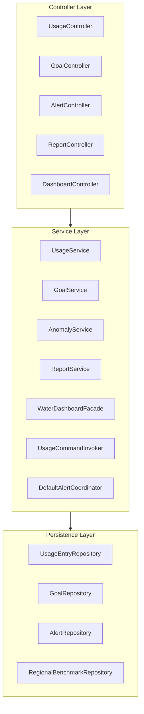

Each controller interacts with specific services and repositories. The diagrams below show each controller's dependency path in isolation:

**UsageController**

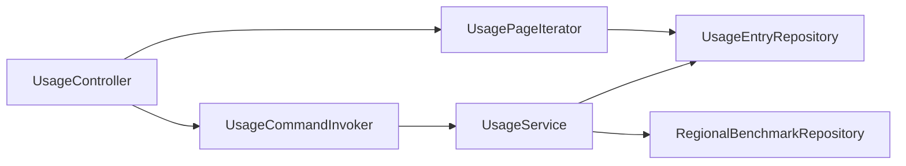

**GoalController**

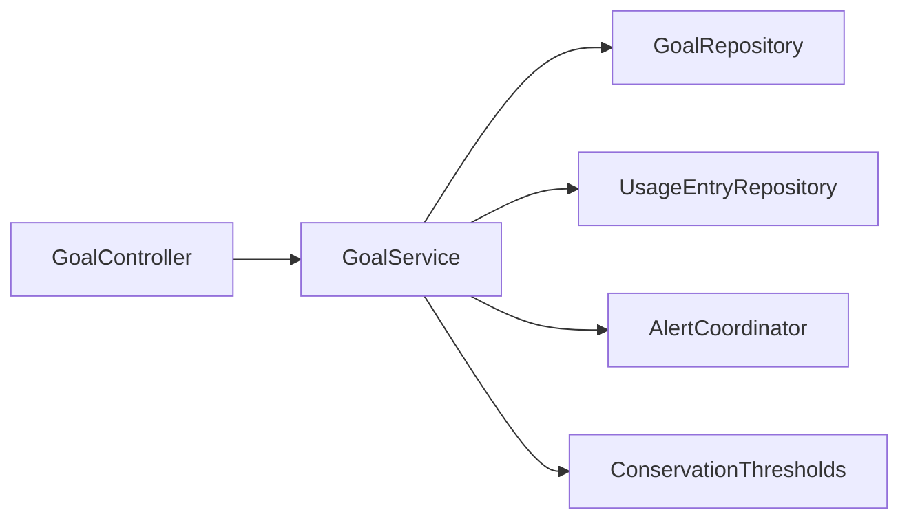

**AlertController**

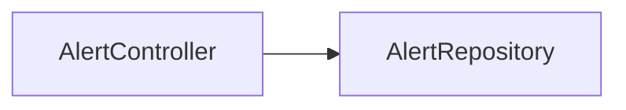

**ReportController**

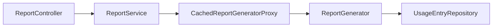

**DashboardController**

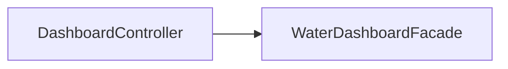

**WaterDashboardFacade** (aggregates all subsystems)

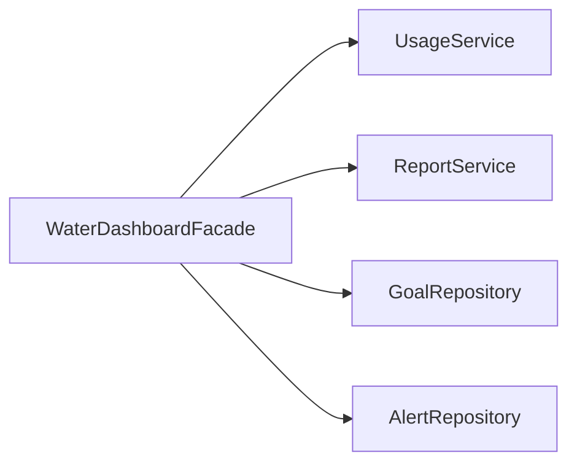

#### Controller → Service Interaction Detail

| Controller | Interacts With | Methods Called |
|-----------|---------------|---------------|
| `UsageController` | `UsageCommandInvoker`, `UsageService`, `UsagePageIterator` | `execute`, `undo`, `logUsage`, `getUsage`, `summarise`, `benchmark`, `exportCsv` |
| `GoalController` | `GoalService` | `createGoal`, `listGoals`, `progressPercent` |
| `AlertController` | `AlertRepository` (direct) | `findByUserIdAndAcknowledgedAtIsNull`, `findById` |
| `ReportController` | `ReportService` | `generateReport` |
| `DashboardController` | `WaterDashboardFacade` | `getDashboard` |
| `WaterDashboardFacade` | `UsageService`, `ReportService`, `GoalRepository`, `AlertRepository` | `summarise`, `generateReport`, `findByUserIdAndState`, `findTop10...` |

#### Observer Event Flow (async, after commit)

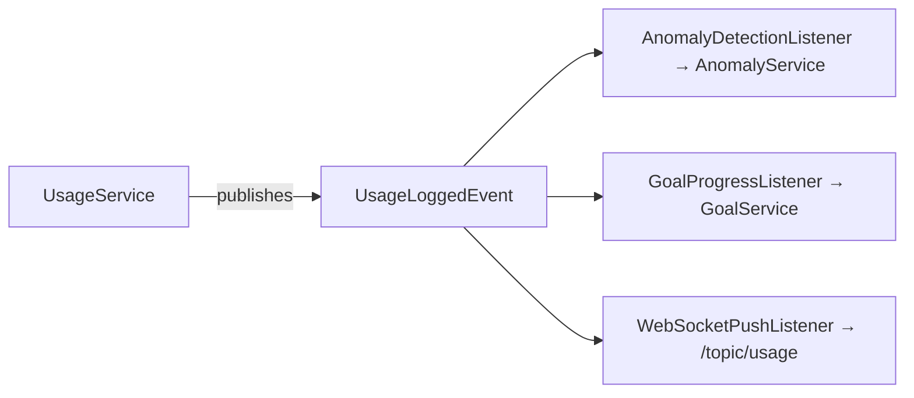

---

## Package Overview

```
com.csen_359.design_patterns
├── config/         — Spring configuration
├── controller/     — REST API endpoints
├── domain/         — JPA entities + enums
├── dto/            — Request/response records
├── event/          — Domain events + listeners
├── repository/     — Data access interfaces
└── service/        — Business logic
    ├── adapter/       — External meter integration
    ├── anomaly/       — Anomaly detection strategies
    ├── bridge/        — Notification delivery
    ├── builder/       — Domain object construction
    ├── calculation/   — Usage adjustment pipeline
    ├── command/       — Undoable operations
    ├── composite/     — Usage grouping tree
    ├── facade/        — Dashboard aggregation
    ├── iterator/      — Paginated data traversal
    ├── mediator/      — Alert coordination
    ├── proxy/         — Cached report generation
    ├── report/        — Report generation pipeline
    ├── scheduler/     — Scheduled background jobs
    ├── singleton/     — Global thresholds
    ├── validation/    — Entry validation pipeline
    └── visitor/       — Usage statistics operations
```

**Pattern-to-package mapping (18 total):**

| # | Pattern | Location |
|---|---------|----------|
| 1 | Adapter | `service/adapter/` |
| 2 | Strategy | `service/anomaly/` |
| 3 | Bridge | `service/bridge/` |
| 4 | Builder | `service/builder/` |
| 5 | Decorator | `service/calculation/` |
| 6 | Command | `service/command/` |
| 7 | Composite | `service/composite/` |
| 8 | Chain of Responsibility | `service/validation/` |
| 9 | Singleton | `service/singleton/` |
| 10 | Observer | `event/` (events + listeners) |
| 11 | State | `domain/GoalState` + `service/GoalService` |
| 12 | Template Method | `service/report/ReportGenerator` |
| 13 | Factory Method | `service/ReportService` |
| 14 | Facade | `service/facade/` |
| 15 | Iterator | `service/iterator/` |
| 16 | Mediator | `service/mediator/` |
| 17 | Proxy | `service/proxy/` |
| 18 | Visitor | `service/visitor/` |

---

## Domain Model

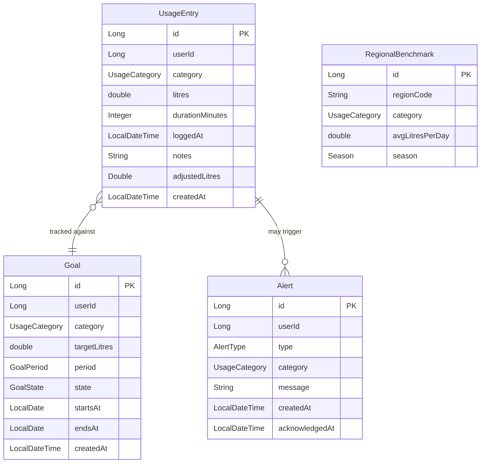

### Enums

| Enum | Values |
|------|--------|
| `UsageCategory` | `SHOWER`, `BATH`, `LAUNDRY`, `DISHWASHER`, `GARDEN`, `DRINKING`, `OTHER` |
| `AlertType` | `SPIKE`, `SUSTAINED_ELEVATION`, `GOAL_WARNING`, `GOAL_MISSED` |
| `GoalState` | `ACTIVE`, `ON_TRACK`, `AT_RISK`, `MISSED`, `ACHIEVED` — `isTerminal()` returns true for MISSED and ACHIEVED |
| `GoalPeriod` | `WEEKLY`, `MONTHLY` |
| `Season` | `WINTER`, `SPRING`, `SUMMER`, `AUTUMN` |

---

## Design Patterns Implemented

### 1. Adapter Pattern (`adapter/`)

Converts external water-meter data (gallons, Unix timestamps, proprietary codes) to the internal `UsageEntry` model.

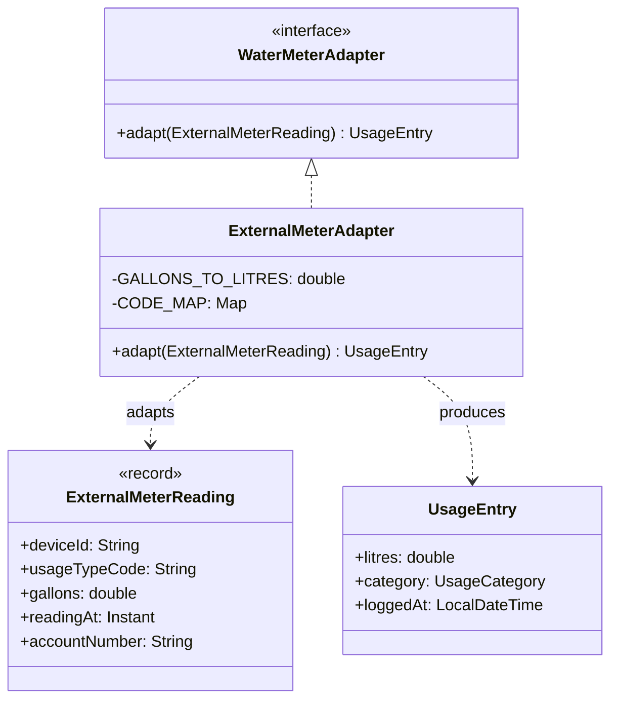

**Responsibilities:**
- Gallons → litres unit conversion
- Proprietary usage-type codes → `UsageCategory` enum
- Unix-epoch `Instant` → `LocalDateTime`

---

### 2. Strategy Pattern (`anomaly/`)

Pluggable anomaly detection algorithms. New detectors are added by creating a `@Component` that implements `AnomalyDetector` — no existing code changes.

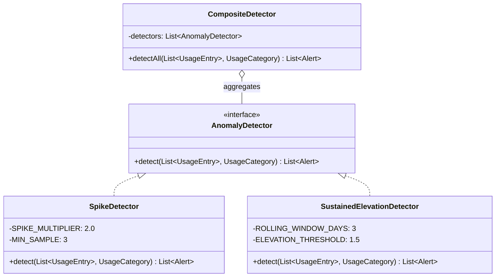

- **SpikeDetector** — Flags a single entry whose litres exceed 2× the category average
- **SustainedElevationDetector** — Flags when the 3-day rolling average > 150% of the 30-day baseline
- **CompositeDetector** — Aggregator that delegates to all registered strategies and merges results

---

### 3. Bridge Pattern (`bridge/`)

Decouples notification content ("what to say") from delivery channel ("how to deliver"). Either hierarchy can evolve independently.

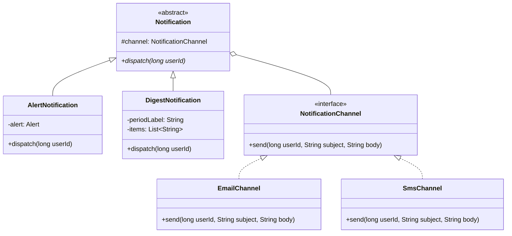

Adding a new channel (push, Slack) requires only a new `NotificationChannel` implementation. Adding a new notification type requires only a new `Notification` subclass. Neither side forces changes on the other.

**Wired via:** `WeeklyDigestJob` injects `NotificationChannel` (defaulting to `EmailChannel` via `@Primary`) and constructs a `DigestNotification` per user to deliver the weekly report summary.

---

### 4. Builder Pattern (`builder/`)

Fluent construction of domain objects with mandatory-field validation at build time.

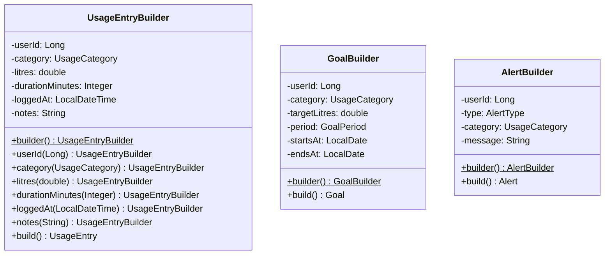

- **UsageEntryBuilder** — Requires userId + category; defaults loggedAt to now
- **GoalBuilder** — Requires userId + period + dates + positive targetLitres; state starts at ACTIVE
- **AlertBuilder** — Requires userId + type + non-blank message

---

### 5. Decorator Pattern (`calculation/`)

Layers adjustments on top of raw usage totals. Decorators are stackable and transparent to callers.

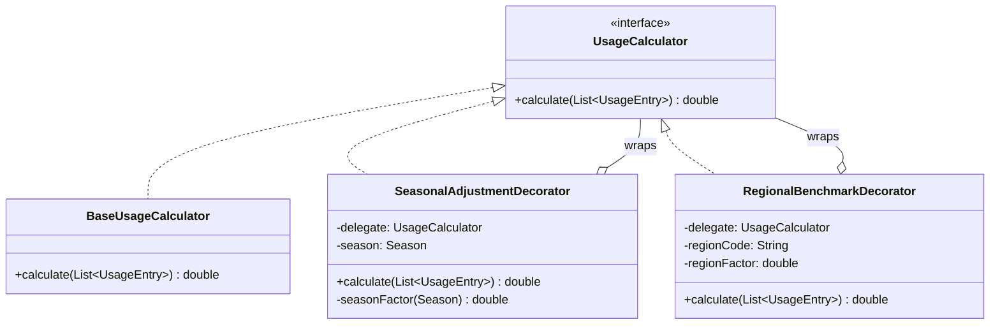

**Typical stack:**

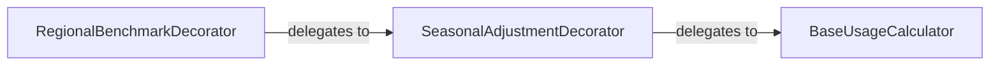

- Summer usage scaled down by 0.9×, winter scaled up by 1.1×
- Regional factor weights litres by water scarcity

---

### 6. Command Pattern (`command/`)

Encapsulates usage operations as undoable objects with a history stack.

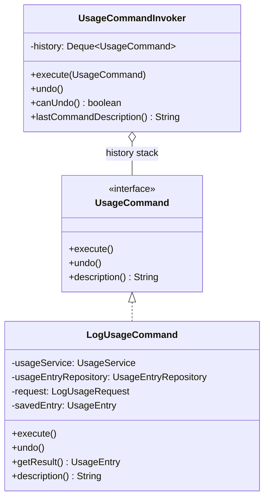

- `execute()` logs the usage entry via `UsageService`
- `undo()` deletes the entry by primary key

**Wired via:** `UsageController` injects `UsageCommandInvoker`. `POST /api/usage` wraps each log operation in a `LogUsageCommand` and pushes it onto the invoker's history. `DELETE /api/usage/undo` pops and reverses the last command.

---

### 7. Chain of Responsibility (`validation/`)

Pipeline of validation handlers. Order is defined in `ValidationChainConfig`. Each handler passes or throws `ValidationException`.

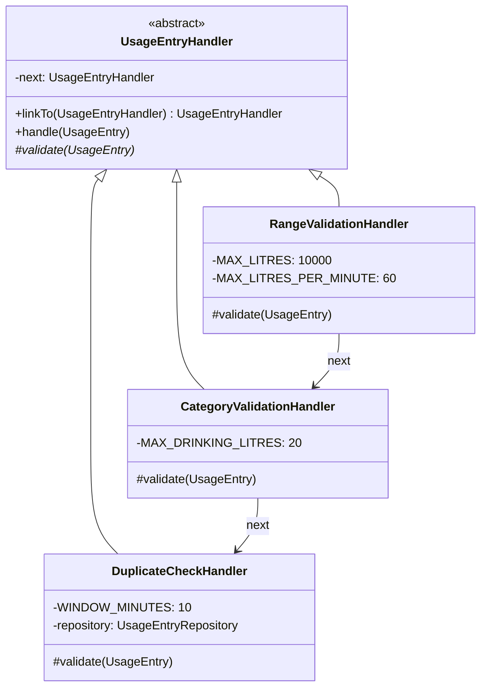

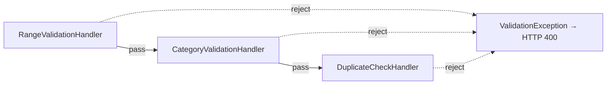

**Validation rules:**
- **Range** — litres ≥ 0, ≤ 10,000; flow rate ≤ 60 L/min
- **Category** — category not null; DRINKING entries ≤ 20 L
- **Duplicate** — no same-user, same-category entry within 10 minutes

---

### 8. Composite Pattern (`composite/`)

Recursive tree structure for grouping usage entries. Dashboard code treats leaves and groups uniformly.

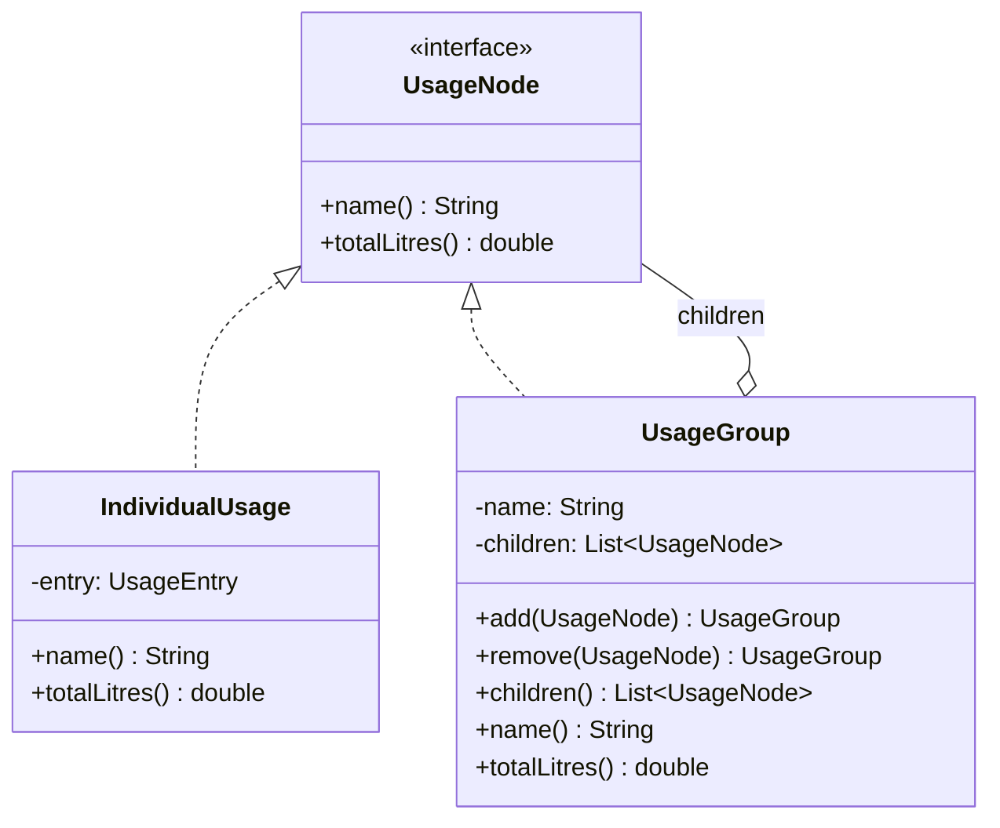

Example: "Indoor" group contains Shower, Bath, Laundry leaves; "All Household" group contains "Indoor" and "Outdoor" sub-groups. `totalLitres()` recurses to any depth.

**Wired via:** `UsageService.summarise()` builds a `UsageGroup` tree from entries grouped by category. Each category becomes a `UsageGroup` containing `IndividualUsage` leaves. The composite's `totalLitres()` is used for verification alongside the Visitor-computed total.

---

### 9. Singleton Pattern (`singleton/`)

Process-wide conservation threshold constants with double-checked locking.

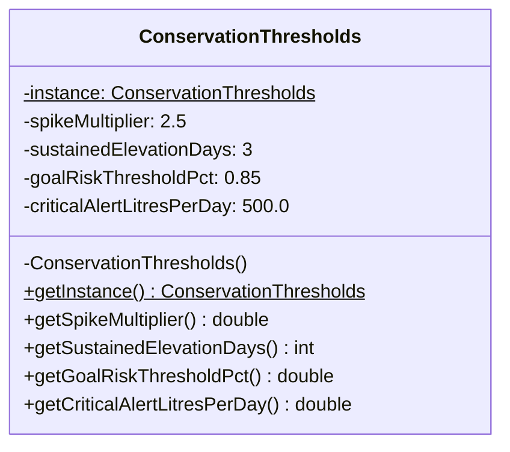

Thread-safe via `volatile` + synchronized double-checked lock. All values are read-only after construction.

**Wired via:** `GoalService.nextState()` reads `getGoalRiskThresholdPct()` to determine the AT_RISK transition point. `AnomalyService.detectAndSave()` reads `getSpikeMultiplier()` and `getSustainedElevationDays()` when routing alerts through the Mediator.

---

### 10. Observer Pattern (`event/`)

Spring's `ApplicationEventPublisher` decouples the write path from downstream reactions. Listeners run asynchronously after the transaction commits.

```mermaid
graph TD
    US[UsageService] -->|publishes| ULE[UsageLoggedEvent]
    GS[GoalService] -->|publishes| GSCE[GoalStatusChangedEvent]

    ULE --> ADL[AnomalyDetectionListener]
    ULE --> GPL[GoalProgressListener]
    ULE --> WSPL[WebSocketPushListener]

    ADL -->|publishes| ADE[AnomalyDetectedEvent]
    ADE --> WSPL
    GSCE --> WSPL

    WSPL --> T1["topic/usage"]
    WSPL --> T2["topic/alerts"]
    WSPL --> T3["topic/goals"]
```

**Event records:**
| Event | Published by | Fields |
|-------|-------------|--------|
| `UsageLoggedEvent` | UsageService | entryId, userId, category, litres, loggedAt |
| `AnomalyDetectedEvent` | AnomalyService | alertId, userId, type, category, message |
| `GoalStatusChangedEvent` | GoalService | goalId, userId, from-state, to-state |

---

### 11. State Pattern (`domain/GoalState` + `service/GoalService`)

A finite-state machine governs goal lifecycle. Transition logic is isolated in `GoalService.nextState()`.

```mermaid
stateDiagram-v2
    [*] --> ACTIVE

    ACTIVE --> ON_TRACK
    ACTIVE --> AT_RISK
    ACTIVE --> MISSED
    ACTIVE --> ACHIEVED

    ON_TRACK --> AT_RISK
    ON_TRACK --> MISSED
    ON_TRACK --> ACHIEVED

    AT_RISK --> MISSED
    AT_RISK --> ACHIEVED

    MISSED --> [*]
    ACHIEVED --> [*]
```

**Transition rules** (evaluated in `GoalService.nextState()`):

| From | To | Condition |
|------|----|-----------|
| ACTIVE | ON_TRACK | usage < 85% of target (Singleton threshold) AND > 7 days remaining |
| ACTIVE / ON_TRACK | AT_RISK | usage ≥ 85% of target (Singleton: `goalRiskThresholdPct`) AND ≤ 7 days remaining |
| ACTIVE / ON_TRACK / AT_RISK | MISSED | usage > 100% of target (budget exceeded) |
| ACTIVE / ON_TRACK / AT_RISK | ACHIEVED | period ends with usage ≤ target |

- `MISSED` and `ACHIEVED` are terminal states (`isTerminal() == true`)
- Transitions are recalculated on every usage event and every 6 hours by `GoalStatusRecalcJob`

---

### 12. Template Method Pattern (`report/`)

Fixed report generation skeleton; subclasses provide only the date window.

```mermaid
classDiagram
    class ReportGenerator {
        <<abstract>>
        #usageEntryRepository: UsageEntryRepository
        #compositeDetector: CompositeDetector
        +generate(Long userId) Report
        #reportType()* String
        #windowStart()* LocalDate
        #windowEnd()* LocalDate
        #gatherData(userId, from, to) List~UsageEntry~
        #computeTotal(entries) double
        #computeByCategory(entries) Map
        #detectAnomalies(entries) int
        #format(from, to, total, byCategory, anomalies) Report
    }

    class WeeklyReportGenerator {
        #reportType() String
        #windowStart() LocalDate
        #windowEnd() LocalDate
    }

    class MonthlyReportGenerator {
        #reportType() String
        #windowStart() LocalDate
        #windowEnd() LocalDate
    }

    class ReportProvider {
        <<interface>>
        +generate(Long userId) Report
    }

    ReportProvider <|.. ReportGenerator
    ReportGenerator <|-- WeeklyReportGenerator
    ReportGenerator <|-- MonthlyReportGenerator
```

**Algorithm skeleton** (in `generate()`, which is `final`):
1. `gatherData()` — fetch entries for the window
2. `computeTotal()` — sum all litres
3. `computeByCategory()` — group and sum by category
4. `detectAnomalies()` — run CompositeDetector per category
5. `format()` — assemble the `Report` record

---

### 13. Factory Method Pattern (`service/ReportService`)

Resolves a period string to the correct `ReportGenerator` subclass at runtime.

```mermaid
graph LR
    Client["ReportController"] -->|"generateReport(userId, period)"| RS["ReportService"]
    RS -->|"period = weekly"| WRG["WeeklyReportGenerator"]
    RS -->|"period = monthly"| MRG["MonthlyReportGenerator"]
    WRG -->|"generate(userId)"| R["Report"]
    MRG -->|"generate(userId)"| R
```

---

### 14. Facade Pattern (`facade/`)

Hides four subsystem interactions behind a single `getDashboard()` call.

```mermaid
graph LR
    Client[DashboardController / Frontend] -->|getDashboard| WDF[WaterDashboardFacade]

    subgraph Subsystems["Coordinated by Facade"]
        US[UsageService.summarise]
        GR[GoalRepository.findByUserIdAndState]
        AR[AlertRepository.findTop10...]
        RS[ReportService.generateReport]
    end

    WDF --> US
    WDF --> GR
    WDF --> AR
    WDF --> RS

    Subsystems -->|assembled into| DV[DashboardView]
    DV -->|returned to| Client
```

**`DashboardView`** (returned record):

| Field | Source |
|-------|--------|
| `usageSummary` | `UsageService.summarise()` |
| `activeGoals` | `GoalRepository.findByUserIdAndState()` |
| `recentAlerts` | `AlertRepository.findTop10ByUserIdOrderByCreatedAtDesc()` |
| `latestReport` | `ReportService.generateReport()` |

The frontend makes a single HTTP call instead of four — the facade orchestrates all subsystems internally.

**Wired via:** `DashboardController` (`GET /api/dashboard?userId=...`) injects `WaterDashboardFacade` and delegates to `getDashboard()`. The React frontend's Dashboard page calls this single endpoint.

---

### 15. Iterator Pattern (`iterator/`)

Pages through usage history without loading the full dataset into memory.

```mermaid
classDiagram
    class UsagePageIterator {
        -repository: UsageEntryRepository
        -userId: long
        -from: LocalDateTime
        -to: LocalDateTime
        -pageSize: int
        -currentPage: int
        -prefetched: List~UsageEntry~
        +hasNext() boolean
        +next() List~UsageEntry~
        -fetchPage(int page) List~UsageEntry~
    }

    class Iterator~T~ {
        <<interface>>
        +hasNext() boolean
        +next() T
    }

    Iterator <|.. UsagePageIterator
```

Also used: `UsageEntryRepository.streamByUserId...()` for CSV export — a JPA streaming cursor consumed inside a transaction without materializing the full result set.

**Wired via:** `UsageController` exposes `GET /api/usage/page` which instantiates a `UsagePageIterator` and advances it to the requested page number, returning one page at a time.

---

### 16. Mediator Pattern (`mediator/`)

Decouples the usage, goal, and anomaly subsystems. They communicate only through the mediator interface, not directly with each other.

```mermaid
classDiagram
    class AlertCoordinator {
        <<interface>>
        +onUsageSpike(userId, category, litres, threshold)
        +onGoalAtRisk(userId, goalId, pctConsumed)
        +onGoalMissed(userId, goalId)
        +onSustainedElevation(userId, category, consecutiveDays)
    }

    class DefaultAlertCoordinator {
        -alertRepository: AlertRepository
        +onUsageSpike(...)
        +onGoalAtRisk(...)
        +onGoalMissed(...)
        +onSustainedElevation(...)
    }

    AlertCoordinator <|.. DefaultAlertCoordinator
```

**How `DefaultAlertCoordinator` creates and persists alerts:**

```mermaid
graph LR
    Subsystem[Usage / Goal / Anomaly Subsystem] -->|calls| DAC[DefaultAlertCoordinator]
    DAC -->|builds alert via| AB[AlertBuilder.builder .userId .type .category .message .build]
    AB -->|produces| A[Alert entity]
    A -->|saved by| AR[AlertRepository.save]
```

Each method in `DefaultAlertCoordinator` follows the same pattern:
1. Receives a notification from a subsystem (e.g. `onUsageSpike`)
2. Uses `AlertBuilder` to fluently construct an `Alert` with the appropriate `AlertType`, category, and formatted message
3. Passes the built `Alert` to `AlertRepository.save()` to persist it

Subsystems call methods on `AlertCoordinator` and have no reference to the alert repository, the builder, or to one another.

**Wired via:** `GoalService` injects `AlertCoordinator` and calls `onGoalAtRisk()` / `onGoalMissed()` when the FSM transitions. `AnomalyService` injects `AlertCoordinator` and calls `onUsageSpike()` / `onSustainedElevation()` when anomalies are detected.

---

### 17. Proxy Pattern (`proxy/`)

Transparent caching proxy for expensive report generation. Callers use the same `ReportProvider` interface.

```mermaid
classDiagram
    class ReportProvider {
        <<interface>>
        +generate(Long userId) Report
    }

    class ReportGenerator {
        +generate(Long userId) Report
    }

    class CachedReportGeneratorProxy {
        -delegate: ReportProvider
        -cachedReport: Report
        -cachedAt: LocalDateTime
        -TTL: 30 minutes
        +generate(Long userId) Report
        +invalidate()
        -isExpired() boolean
    }

    class ReportService {
        -weeklyProxy: CachedReportGeneratorProxy
        -monthlyProxy: CachedReportGeneratorProxy
        +generateReport(Long userId, String period) Report
        +invalidateCache(String period)
    }

    ReportProvider <|.. ReportGenerator
    ReportProvider <|.. CachedReportGeneratorProxy
    CachedReportGeneratorProxy o-- ReportProvider : delegates to
    ReportService o-- CachedReportGeneratorProxy : wraps generators
```

- Returns cached result for 30 minutes after the first call
- `invalidate()` forces a fresh computation on the next request

**Wired via:** `ReportService` wraps each `ReportGenerator` (weekly, monthly) in a `CachedReportGeneratorProxy` at construction time. The proxy is transparent to `ReportController` and `WaterDashboardFacade` — they still call `generateReport()` and get cached results within the TTL window.

---

### 18. Visitor Pattern (`visitor/`)

Adds analytical operations to `UsageEntry` collections without modifying the entity class.

```mermaid
classDiagram
    class UsageVisitor {
        <<interface>>
        +visit(UsageEntry)
    }

    class TotalVolumeVisitor {
        -totalLitres: double
        +visit(UsageEntry)
        +getTotalLitres() double
    }

    class CategoryBreakdownVisitor {
        -totals: Map~UsageCategory, Double~
        +visit(UsageEntry)
        +getTotals() Map
    }

    class UsageStatisticsApplier {
        +apply(List~UsageEntry~, UsageVisitor)$
    }

    UsageVisitor <|.. TotalVolumeVisitor
    UsageVisitor <|.. CategoryBreakdownVisitor
    UsageStatisticsApplier ..> UsageVisitor : drives
```

New computations (carbon footprint, cost estimation, per-fixture benchmarking) are added by writing a new `UsageVisitor` implementation — no changes to the entity or service layer.

**Wired via:** `UsageService.summarise()` applies `TotalVolumeVisitor` and `CategoryBreakdownVisitor` via `UsageStatisticsApplier` to compute the total litres and per-category breakdown returned by `GET /api/usage/summary`.

---

## Core Data Flows

### Log Usage (Write Path)

```mermaid
sequenceDiagram
    participant Client
    participant UsageController
    participant Invoker as UsageCommandInvoker
    participant Command as LogUsageCommand
    participant UsageService
    participant Builder as UsageEntryBuilder
    participant Chain as Validation Chain
    participant Decorator as Decorator Stack
    participant Repo as UsageEntryRepository
    participant Publisher as EventPublisher

    Client->>UsageController: POST /api/usage
    UsageController->>Invoker: execute(LogUsageCommand)
    Invoker->>Command: execute()
    Command->>UsageService: logUsage(request)

    UsageService->>Builder: builder().userId().category().litres()...build()
    Builder-->>UsageService: UsageEntry

    UsageService->>Chain: handle(entry)
    Note over Chain: Range → Category → Duplicate

    UsageService->>Decorator: calculate(List.of(entry))
    Note over Decorator: Base → Seasonal → Regional
    Decorator-->>UsageService: adjustedLitres

    UsageService->>Repo: save(entry)
    Repo-->>UsageService: savedEntry

    UsageService->>Publisher: publish(UsageLoggedEvent)

    Publisher-->>ADL: AnomalyDetectionListener
    Publisher-->>GPL: GoalProgressListener
    Publisher-->>WSPL: WebSocketPushListener

    UsageService-->>Command: savedEntry
    Command-->>Invoker: (pushed to history)
    Invoker-->>UsageController: done
    UsageController-->>Client: 201 Created + UsageEntryResponse
```

### Anomaly Detection

```mermaid
sequenceDiagram
    participant Event as UsageLoggedEvent
    participant ADL as AnomalyDetectionListener
    participant AS as AnomalyService
    participant CT as ConservationThresholds
    participant Repo as UsageEntryRepository
    participant CD as CompositeDetector
    participant SD as SpikeDetector
    participant SED as SustainedElevationDetector
    participant AR as AlertRepository
    participant DAC as AlertCoordinator
    participant Pub as EventPublisher

    Event->>ADL: onUsageLogged (async, after commit)
    ADL->>AS: detectAndSave(userId, category)
    AS->>Repo: findByUserIdAndCategory (last 30 days)
    Repo-->>AS: List<UsageEntry>
    AS->>CD: detectAll(entries, category)
    CD->>SD: detect(entries, category)
    SD-->>CD: alerts (if any)
    CD->>SED: detect(entries, category)
    SED-->>CD: alerts (if any)
    CD-->>AS: merged alerts
    AS->>AR: saveAll(alerts)
    AS->>CT: getInstance() [Singleton]
    AS->>DAC: onUsageSpike / onSustainedElevation [Mediator]
    AS->>Pub: publish(AnomalyDetectedEvent) per alert
    Pub-->>WSPL: → /topic/alerts
```

### Goal FSM Recalculation

```mermaid
sequenceDiagram
    participant Event as UsageLoggedEvent
    participant GPL as GoalProgressListener
    participant GS as GoalService
    participant CT as ConservationThresholds
    participant GR as GoalRepository
    participant UER as UsageEntryRepository
    participant DAC as AlertCoordinator
    participant Pub as EventPublisher

    Event->>GPL: onUsageLogged (async, after commit)
    GPL->>GS: applyUsage(event)
    GS->>GR: findByUserId(userId)
    GR-->>GS: List<Goal> (non-terminal, matching category)

    loop For each affected goal
        GS->>UER: query entries in goal window
        UER-->>GS: entries
        GS->>GS: progressPercent(goal)
        GS->>CT: getInstance().getGoalRiskThresholdPct() [Singleton]
        GS->>GS: nextState(goal) [FSM transition]
        alt state changed
            GS->>GR: save(goal)
            GS->>Pub: publish(GoalStatusChangedEvent)
            Pub-->>WSPL: → /topic/goals
            alt AT_RISK or MISSED
                GS->>DAC: onGoalAtRisk / onGoalMissed [Mediator]
            end
        end
    end
```

---

## Class Reference by Package

### `controller/`
| Class | Purpose |
|-------|---------|
| `UsageController` | CRUD for usage entries + summary, benchmark, CSV export, undo (Command), pagination (Iterator) |
| `GoalController` | Create and list conservation goals |
| `AlertController` | List and acknowledge alerts |
| `ReportController` | Generate weekly/monthly reports |
| `DashboardController` | Aggregated dashboard view via Facade |
| `WebSocketController` | STOMP ping/pong endpoint |
| `ApiExceptionHandler` | Maps exceptions → JSON error responses (400, 404, 501) |

### `service/`
| Class | Purpose |
|-------|---------|
| `UsageService` | Core write path: Builder → Chain → Decorator → Observer → Visitor → Composite |
| `GoalService` | Goal CRUD + State-pattern FSM transitions + Mediator (AlertCoordinator) + Singleton (ConservationThresholds) |
| `AnomalyService` | Delegates to CompositeDetector, persists alerts, publishes events, notifies Mediator, reads Singleton thresholds |
| `ReportService` | Factory Method: resolves period → CachedReportGeneratorProxy (Proxy) → ReportGenerator |

### `domain/`
| Class | Purpose |
|-------|---------|
| `UsageEntry` | JPA entity — single water usage log |
| `Goal` | JPA entity — conservation goal with FSM state |
| `Alert` | JPA entity — anomaly alert (soft-delete via acknowledgedAt) |
| `RegionalBenchmark` | JPA entity — seeded reference data for regional comparison |
| `UsageCategory` | Enum: SHOWER, BATH, LAUNDRY, DISHWASHER, GARDEN, DRINKING, OTHER |
| `AlertType` | Enum: SPIKE, SUSTAINED_ELEVATION, GOAL_WARNING, GOAL_MISSED |
| `GoalState` | Enum with `isTerminal()`: ACTIVE, ON_TRACK, AT_RISK, MISSED, ACHIEVED |
| `GoalPeriod` | Enum: WEEKLY, MONTHLY |
| `Season` | Enum: WINTER, SPRING, SUMMER, AUTUMN |

### `repository/`
| Class | Purpose |
|-------|---------|
| `UsageEntryRepository` | Date-range queries, streaming, archival, bulk delete |
| `GoalRepository` | State-based queries |
| `AlertRepository` | Unacknowledged alerts, recent alerts |
| `RegionalBenchmarkRepository` | Region/category/season lookup |

### `scheduler/`
| Class | Schedule | Purpose |
|-------|----------|---------|
| `AnomalyDetectionJob` | Nightly (02:00) | Sweeps all users/categories for anomalies |
| `GoalStatusRecalcJob` | Every 6 hours | Recomputes FSM state for active goals |
| `DataCleanupJob` | Monthly (1st, 03:00) | Archives entries older than 2 years |
| `WeeklyDigestJob` | Sunday (08:00) | Generates weekly reports and delivers digests via Bridge (DigestNotification → NotificationChannel) |

### `dto/`
| Class | Direction | Purpose |
|-------|-----------|---------|
| `LogUsageRequest` | Request | POST /api/usage body (with Bean Validation) |
| `CreateGoalRequest` | Request | POST /api/goals body |
| `UsageEntryResponse` | Response | Usage entry API view |
| `GoalResponse` | Response | Goal + progress percentage API view |
| `AlertResponse` | Response | Alert API view |
| `UsageSummaryResponse` | Response | Aggregate totals for a period |
| `BenchmarkResponse` | Response | User vs. regional average comparison |

### `config/`
| Class | Purpose |
|-------|---------|
| `ValidationChainConfig` | Assembles Chain of Responsibility pipeline as a Spring bean |
| `WebSocketConfig` | STOMP/WebSocket: endpoint `/ws/dashboard`, broker `/topic/*` |

---

## Technology Stack

- **Framework:** Spring Boot 4.0.x
- **Language:** Java 17
- **Persistence:** Spring Data JPA / Hibernate + PostgreSQL + Flyway migrations
- **Caching:** Spring Cache + Redis
- **Real-time:** STOMP over WebSocket with SockJS fallback
- **Scheduling:** Spring `@Scheduled` with configurable cron expressions
- **Async:** Spring `@Async` + `@TransactionalEventListener`
- **Validation:** Bean Validation (Jakarta) + custom Chain of Responsibility
- **API Docs:** SpringDoc OpenAPI (Swagger UI)
- **Build:** Maven
- **Frontend:** React 19 + Vite (connects via REST + STOMP WebSocket)
